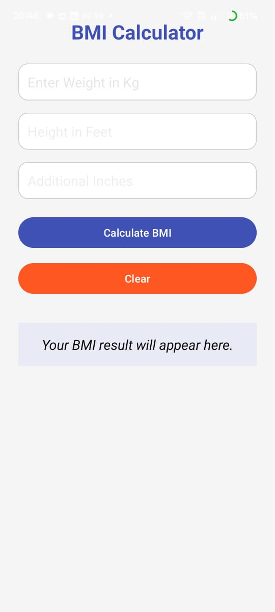
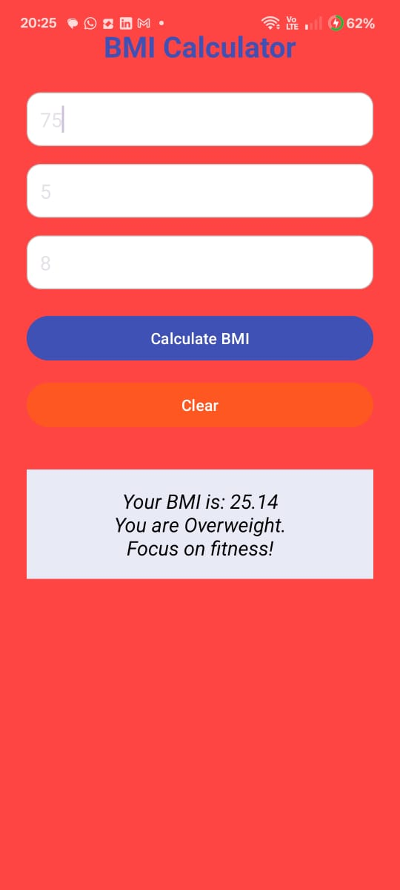
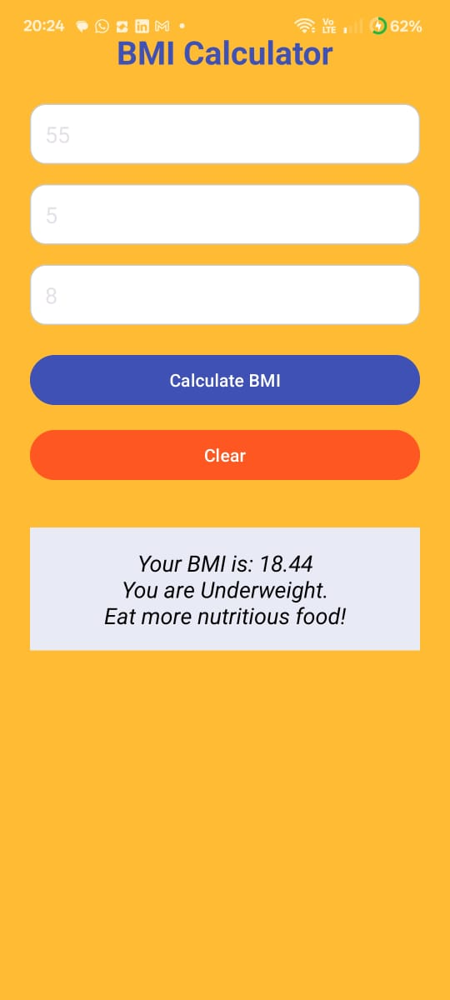
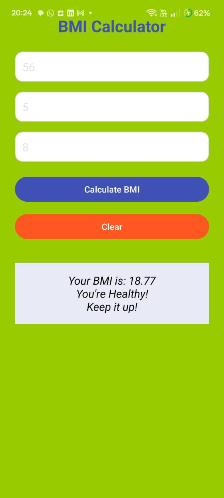

# 🧮 BMI Calculator Android App

A simple and clean Android application that calculates the **Body Mass Index (BMI)** based on the user's weight and height input. This app helps users easily understand their BMI category such as Underweight, Normal, Overweight, or Obese.

## 📱 Features

- User-friendly interface using XML layouts
- Input fields for height (in cm) and weight (in kg)
- Instant BMI calculation on button click
- Displays BMI value and health category
- Lightweight and fast performance

## 🚀 Screenshots

## 📱 Screenshots

### 🏠 Home Screen


### 📊 BMI Result Screen





## 🛠️ Tech Stack

- **Language**: Java  
- **UI**: XML  
- **Framework**: Android SDK  
- **IDE**: Android Studio

## 🔢 How BMI is Calculated

BMI is calculated using the formula:
BMI = weight / (height * height)


BMI Categories:
- **Underweight**: BMI < 18.5  
- **Normal weight**: 18.5 ≤ BMI < 24.9  
- **Overweight**: 25 ≤ BMI < 29.9  
- **Obese**: BMI ≥ 30  

## 💻 How to Run

1. Clone the repository:
   ```bash
   git clone https://github.com/your-username/BMI-Calculator.git

